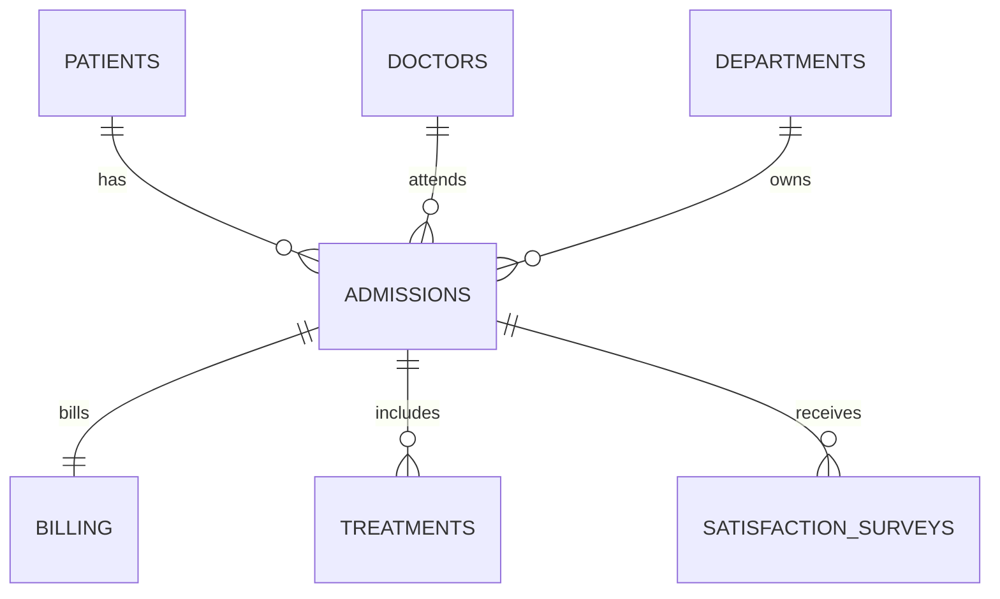

# Er Diagram

```mermaid
erDiagram
    PATIENTS ||--o{ ADMISSIONS : has
    DOCTORS ||--o{ ADMISSIONS : attends
    DEPARTMENTS ||--o{ ADMISSIONS : owns
    ADMISSIONS ||--|| BILLING : bills
    ADMISSIONS ||--o{ TREATMENTS : includes
    ADMISSIONS ||--o{ SATISFACTION_SURVEYS : receives
```
